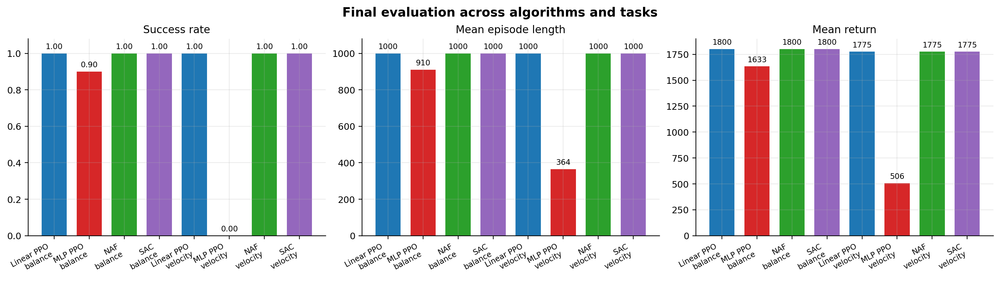
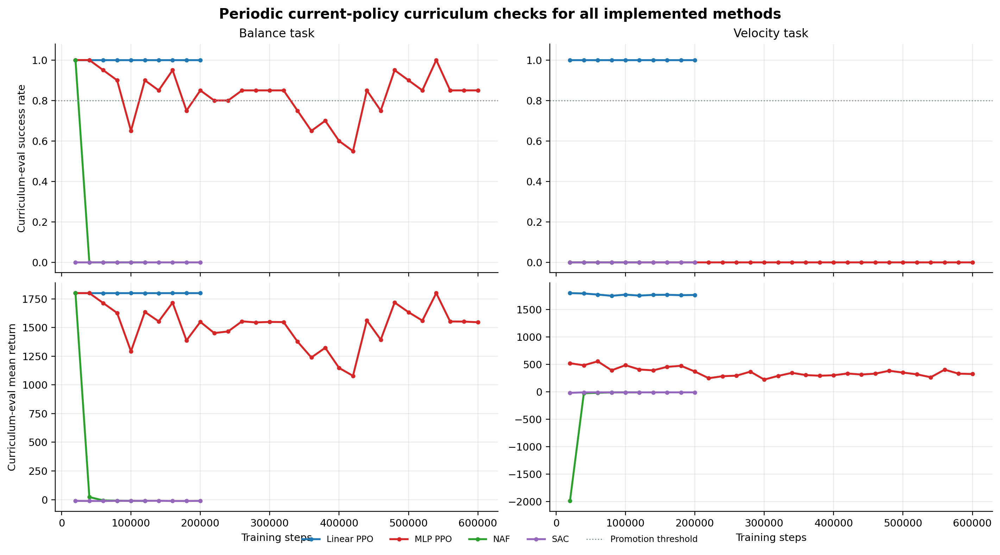
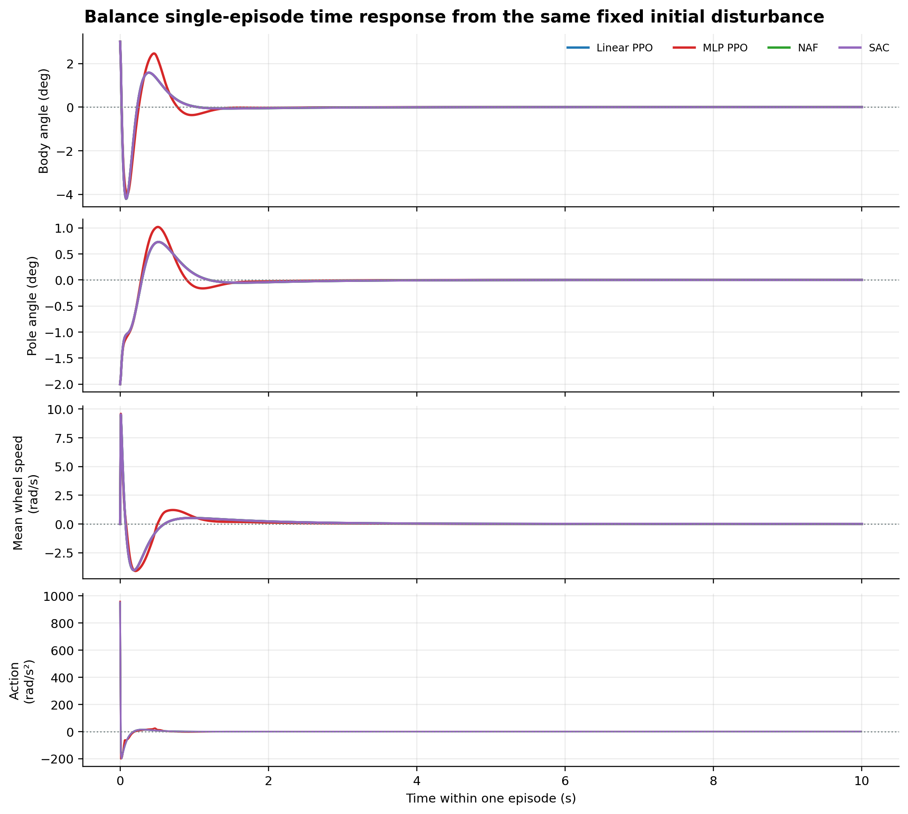
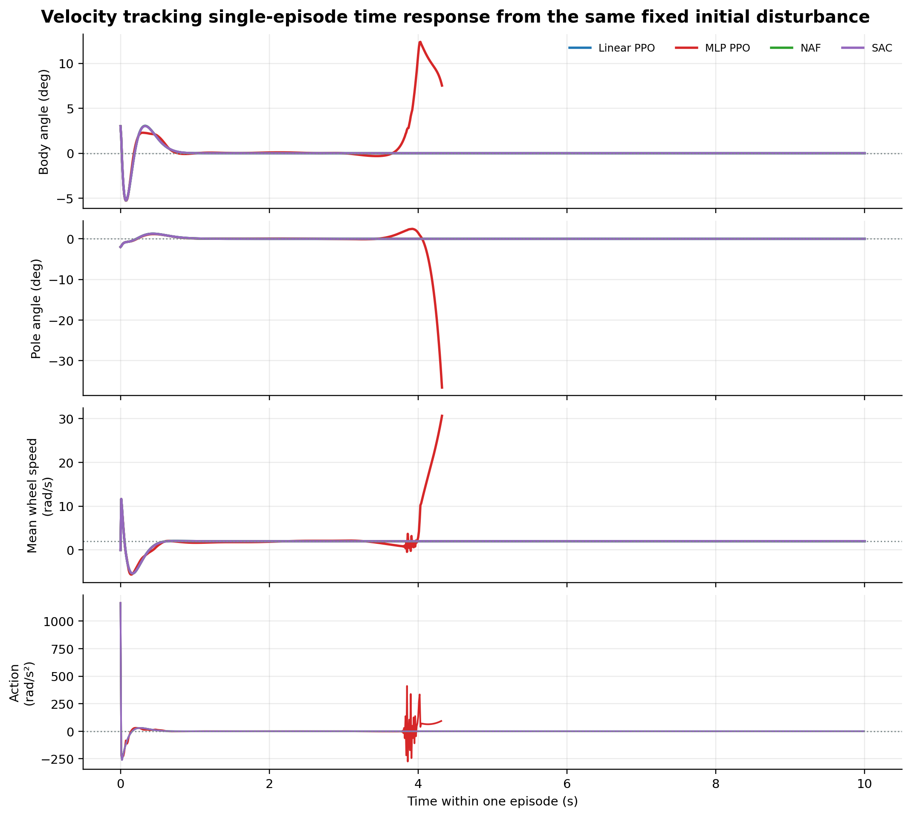
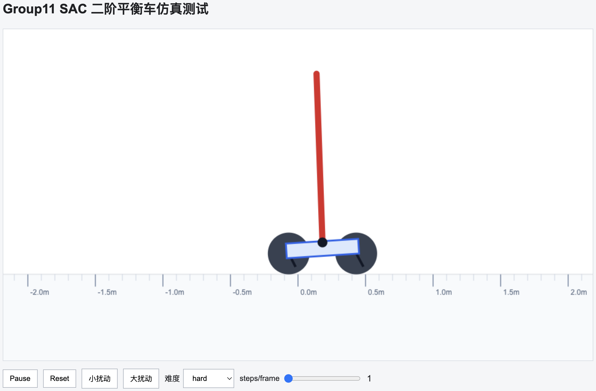
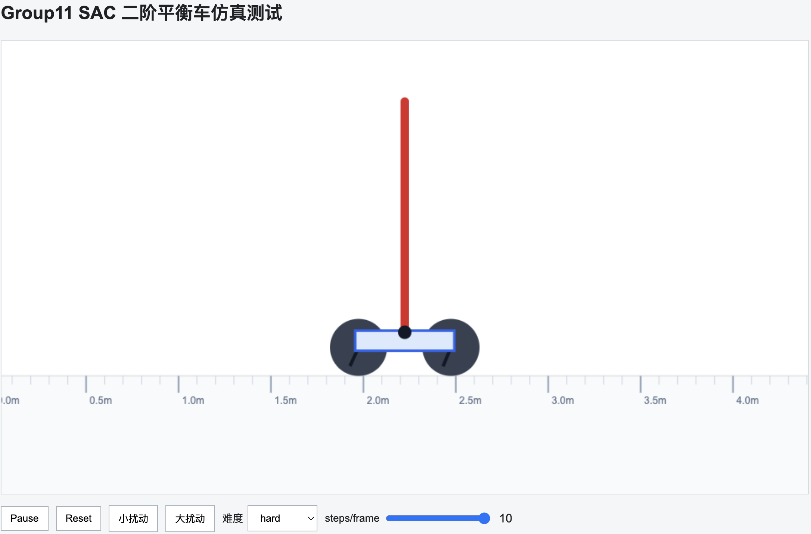

# UCSA-RL-2026-Group11

本仓库为国科大 2026 年强化学习课程大作业 Group 11 项目仓库，主题是二阶平衡车强化学习控制。

当前仓库已完成 **共享仿真环境**、**PPO 仿真训练模块**、**NAF 仿真训练模块**、**SAC 仿真训练模块**、模型导出、网页可视化与实验报告整理。实验结果已覆盖原地平衡与匀速平衡两个任务，并对 Linear PPO、MLP PPO、NAF、SAC 进行了统一对比。完整的实验报告在[实验报告](reports/group11_technical_report/曾凡硕-强化学习实验报告.pdf)。

## 当前仓库结构

```text
UCSA-RL-2026-Group11/
├── README.md
├── pyproject.toml
├── uv.lock
├── configs/
│   ├── naf_curriculum.yaml
│   ├── naf_velocity.yaml
│   ├── ppo_curriculum.yaml
│   ├── ppo_mlp.yaml
│   ├── ppo_mlp_velocity.yaml
│   ├── ppo_velocity.yaml
│   ├── sac_curriculum.yaml
│   └── sac_velocity.yaml
├── src/
│   └── group11_balance/
│       ├── __init__.py
│       ├── check_env.py
│       ├── train_naf.py                  # NAF 兼容入口
│       ├── train_ppo.py                  # PPO 兼容入口
│       ├── train_sac.py                  # SAC 兼容入口
│       ├── sim/                          # 共享仿真环境
│       │   ├── __init__.py
│       │   ├── control.py                # LQR 教师控制器、baseline 与 warm start
│       │   ├── dynamics.py
│       │   ├── env.py
│       │   ├── reward.py
│       │   └── task.py                   # balance / velocity 任务定义
│       ├── algorithms/
│       │   ├── naf/
│       │   │   ├── __init__.py
│       │   │   ├── model.py
│       │   │   └── train.py
│       │   ├── ppo/
│       │   │   ├── __init__.py
│       │   │   └── train.py
│       │   └── sac/
│       │       ├── __init__.py
│       │       └── train.py
│       ├── deploy/
│       │   ├── __init__.py
│       │   └── export_to_c.py
│       └── visualization/
│           ├── __init__.py
│           ├── naf_web_demo.py
│           ├── policy_web_demo.py
│           ├── rollout_html.py
│           ├── sac_web_demo.py
│           └── web_demo.py
├── outputs/
│   ├── firmware/
│   ├── logs/
│   ├── models/
│   └── visualizations/
├── firmware/                             # 小车固件源码、烧录工具、文档与 hex 固件
│   ├── README.md                         # 烧录、WiFi 与上板说明
│   ├── hex/                              # 统一存放可烧录的 .hex 文件
│   ├── keil/                             # STM32/Keil 工程源码
│   ├── tools/                            # mcuisp 与 USB 串口驱动
│   └── docs/                             # 硬件与 WiFi 说明文档
└── reports/
    └── group11_technical_report/         # 技术报告、实验曲线与可复现绘图脚本
```

## 模块状态

| 模块 | 状态 | 说明 |
|---|---|---|
| 共享仿真环境 | 已完成初版 | `TwoStageBalanceEnv`，供不同算法复用，支持 `balance` / `velocity` 两个任务 |
| 动力学模型 | 已完成初版 | 使用离散线性状态空间模型 |
| Reward 设计 | 已完成初版 | 奖励直立、稳定和平滑控制，惩罚摔倒和过大动作 |
| LQR baseline | 已完成初版 | 用于验证仿真环境，也用于 PPO / NAF / SAC 训练前 warm start |
| PPO 仿真训练 | 已完成初版 | 使用 Stable-Baselines3 PPO，默认采用线性 actor |
| PPO MLP 对照实验 | 已完成初版 | 使用非线性的 `[32, 16]` MLP actor |
| PPO 课程学习 | 已完成初版 | 支持 `easy -> medium -> hard` 难度提升 |
| PPO 网页可视化 | 已完成初版 | 支持加载模型、浏览器显示仿真、手动加入扰动 |
| NAF 仿真训练 | 已完成初版 | 自实现 Normalized Advantage Functions，复用共享环境 |
| NAF 课程学习 | 已完成初版 | 支持 replay buffer、target network 与 `easy -> medium -> hard` 难度提升 |
| NAF 网页可视化 | 已完成初版 | 支持加载 NAF checkpoint、浏览器显示仿真、手动加入扰动 |
| SAC 仿真训练 | 已完成初版 | 使用 Stable-Baselines3 SAC，复用共享环境、课程学习、LQR warm start 与 best checkpoint |
| SAC 可视化与导出 | 已完成初版 | 支持 live HTML demo、自包含 rollout HTML、C 头文件导出和报告图分析 |
| 固件与上板 | 已加入初版 | 位于 `firmware/`，包含 Keil 工程、烧录工具、WiFi/硬件说明和统一整理的 hex 固件 |
| 实验结果对比 | 已完成初版 | 已整理最终指标、单 episode 收敛响应、课程评估曲线与失败原因分布 |
| 技术报告 | 已完成 | 位于 `reports/group11_technical_report/` |

## 实验结果对比

本仓库当前比较了四类策略：线性 actor 的 PPO、非线性 MLP actor 的 PPO、NAF 和 SAC。所有方法共用同一个二阶平衡车仿真环境、同一动作尺度 `action_limit=8000.0`，并在 `balance` 与 `velocity` 两个任务上进行最终评估。



| 算法 | 任务 | 最终评估难度 | 成功率 | 平均长度 | 平均回报 |
|---|---|---|---:|---:|---:|
| Linear PPO | balance | hard | 1.00 | 1000.0 | 1799.70 |
| MLP PPO | balance | hard | 0.90 | 910.0 | 1633.42 |
| NAF | balance | hard | 1.00 | 1000.0 | 1799.70 |
| SAC | balance | hard | 1.00 | 1000.0 | 1799.71 |
| Linear PPO | velocity | hard | 1.00 | 1000.0 | 1775.22 |
| MLP PPO | velocity | easy | 0.00 | 364.2 | 505.63 |
| NAF | velocity | hard | 1.00 | 1000.0 | 1775.22 |
| SAC | velocity | hard | 1.00 | 1000.0 | 1775.27 |

从最终结果看，Linear PPO、NAF 和 SAC 在两个任务上均达到 hard 难度 100% 成功率；MLP PPO 在原地平衡任务中多数 episode 可以完成，但在速度跟踪任务中未能通过 easy 难度。结合训练日志和课程评估曲线，Linear PPO 的当前策略最稳定；NAF 和 SAC 的最终高分主要依赖 warm-start 阶段保存的 best checkpoint，后续 off-policy 更新过程中当前策略会出现退化；MLP PPO 的非线性表达能力没有在当前线性仿真模型中带来收益，反而在速度任务中更容易产生姿态和轮速之间的冲突。



单 episode 响应曲线用于观察策略受到同一初始扰动后的动态过程。原地平衡任务中，Linear PPO、NAF、SAC 的响应几乎重合，说明三者最终确定性 actor 都接近稳定的线性反馈律；速度任务中，Linear PPO、NAF、SAC 能在姿态收敛后跟踪目标轮速 `2.0 rad/s`，而 MLP PPO 会在约 4.32 秒因摆杆向外倾倒终止。





更完整的收敛性、最优性、计算量、动作尺度和失败原因分析见：

```text
reports/group11_technical_report/曾凡硕-强化学习实验报告.pdf
```

## 快速开始

安装依赖：

```bash
UV_CACHE_DIR=.uv-cache uv sync
```

检查仿真环境：

```bash
MPLCONFIGDIR=.mpl-cache UV_CACHE_DIR=.uv-cache uv run python -m group11_balance.check_env
```

## 共享仿真环境

仿真环境模块位于：

```text
src/group11_balance/sim/
```

主要文件：

- `dynamics.py`：构建二阶平衡车线性动力学模型；
- `env.py`：定义 Gymnasium 仿真环境；
- `control.py`：定义 LQR 教师控制器，可用于 baseline、PPO / NAF / SAC warm start；
- `reward.py`：定义平衡与匀速任务奖励函数；
- `task.py`：定义 `balance`、`velocity` 任务名与目标轮速检查。

后续其他算法，例如 NAF、SAC、TD3、DDPG，应优先复用这里的 `TwoStageBalanceEnv`，避免每个算法重复写一套环境。

强化学习训练不是从固定离线数据集中读取样本，而是和仿真环境在线交互：

```text
当前状态 state
    ↓
算法策略输出动作 action
    ↓
仿真环境计算 next_state 和 reward
    ↓
算法根据交互轨迹更新策略
```

## 状态、动作与动力学

状态顺序：

```text
theta_l, theta_r, theta_l_dot, theta_r_dot,
body_angle, body_rate, pole_angle, pole_rate
```

含义：

- `theta_l` / `theta_r`：左右轮角度；
- `theta_l_dot` / `theta_r_dot`：左右轮角速度；
- `body_angle`：车身倾角；
- `body_rate`：车身角速度；
- `pole_angle`：摆杆倾角；
- `pole_rate`：摆杆角速度。

仿真环境使用离散线性状态空间模型：

```text
x[k+1] = G x[k] + H u[k]
```

其中：

- `x[k]` 是当前 8 维状态；
- `u[k]` 是当前控制动作；
- `G` 描述系统自然演化；
- `H` 描述控制动作对系统的影响。

当前 PPO、NAF 和 SAC 策略都输出 1 维归一化动作：

```text
a ∈ [-1, 1]
```

环境内部映射成左右轮同向控制：

```text
[u_l, u_r] = [action_limit * a, action_limit * a]
```

当前上车配置使用 `action_limit: 8000.0`，使策略输出与固件中 `u_L/u_R`
轮角加速度控制输入的尺度一致。该设计用于降低训练难度，使策略优先学习
前后方向平衡，而不是学习左右轮差速转向。

## 任务设置

当前环境支持两个任务，通过训练和可视化命令中的 `--task` 或配置文件字段选择：

```text
balance   原地平衡，目标是保持直立、速度接近 0、轮子不漂离中心
velocity  平衡匀速运动，目标是在保持直立的同时跟踪固定平均轮速
```

`velocity` 任务的目标轮速由 `target_wheel_velocity` / `--target-wheel-velocity` 指定，单位是 rad/s。当前配置默认使用固定目标：

```yaml
task: velocity
target_wheel_velocity: 2.0
```

注意：状态观测仍然保持 8 维，目标速度不会作为第 9 维输入策略。因此一个训练好的 `velocity` 模型默认只对应训练时指定的固定目标速度；如果要换目标速度，建议重新训练并另存一份模型。

常用可选参数：

- `--task balance|velocity`：选择原地平衡或平衡匀速运动；
- `--target-wheel-velocity 2.0`：设置匀速任务目标平均轮速；
- `--start-level easy|medium|hard` / `--max-level easy|medium|hard`：设置课程学习难度范围；
- `--total-steps`：训练总步数；
- `--model-path` / `--eval-csv` / `--train-log`：指定输出路径，避免覆盖已有模型和日志；
- `--eval-episodes` / `--promotion-eval-episodes`：覆盖最终评估和课程评估 episode 数，用于 smoke test 时缩短运行时间。

## PPO 模块

PPO 训练模块位于：

```text
src/group11_balance/algorithms/ppo/train.py
```

同时保留兼容入口：

```text
src/group11_balance/train_ppo.py
```

因此下面两个命令等价：

```bash
uv run python -m group11_balance.train_ppo ...
uv run python -m group11_balance.algorithms.ppo.train ...
```

PPO 为在线强化学习算法，因此我们首先根据动力学参数构造仿真环境，让 PPO 在仿真环境中不断采样状态、动作、奖励，并根据课程学习逐步提高初始状态扰动难度。

当前版本默认采用 **线性 PPO actor + LQR 精确初始化**。

这样设计的原因是：平衡车在小角度附近可以用线性状态空间模型近似，而 LQR 本身就是线性反馈控制律。如果用较深的 MLP 去近似这个线性控制律，训练时容易因为动作探索和函数近似误差把稳定控制器“学偏”；改成线性 actor 后，PPO 仍然是 PPO，只是策略结构更贴合当前仿真动力学。

这不是使用真实小车数据，也不是离线 RL。训练数据仍然来自 PPO 与仿真环境的在线交互；LQR 只用于给 actor 一个稳定的初始控制律。

训练时终端只显示 `tqdm` 进度条。详细信息会写入日志文件：

```text
outputs/logs/group11_ppo_train.log
```

日志中包含：

- 训练配置；
- curriculum 每次评估结果；
- 每个评估 episode 的最终状态；
- 是否成功；
- 失败原因；
- 最终评估指标。

训练过程中会根据课程评估保存 best checkpoint。训练结束后，`outputs/models/group11_ppo.zip` 会被替换为验证表现最好的策略，而不是简单保存最后一步策略。

短训练测试：

```bash
MPLCONFIGDIR=.mpl-cache UV_CACHE_DIR=.uv-cache uv run python -m group11_balance.algorithms.ppo.train \
  --config configs/ppo_curriculum.yaml \
  --total-steps 2000 \
  --no-curriculum \
  --model-path outputs/models/smoke_ppo.zip \
  --eval-csv outputs/logs/smoke_ppo_eval.csv \
  --train-log outputs/logs/smoke_ppo_train.log
```

正式训练：

```bash
MPLCONFIGDIR=.mpl-cache UV_CACHE_DIR=.uv-cache uv run python -m group11_balance.algorithms.ppo.train \
  --config configs/ppo_curriculum.yaml
```

线性 PPO 匀速平衡训练：

```bash
MPLCONFIGDIR=.mpl-cache UV_CACHE_DIR=.uv-cache uv run python -m group11_balance.algorithms.ppo.train \
  --config configs/ppo_velocity.yaml
```

也可以直接覆盖任务参数和输出路径：

```bash
MPLCONFIGDIR=.mpl-cache UV_CACHE_DIR=.uv-cache uv run python -m group11_balance.algorithms.ppo.train \
  --config configs/ppo_curriculum.yaml \
  --task velocity \
  --target-wheel-velocity 2.0 \
  --model-path outputs/models/group11_ppo_velocity.zip \
  --eval-csv outputs/logs/group11_ppo_velocity_eval.csv \
  --train-log outputs/logs/group11_ppo_velocity_train.log
```

原地平衡正式训练默认输出：

```text
outputs/models/group11_ppo.zip
outputs/logs/group11_ppo_eval.csv
outputs/logs/group11_ppo_train.log
```

线性 PPO 匀速平衡正式训练默认输出：

```text
outputs/models/group11_ppo_velocity.zip
outputs/logs/group11_ppo_velocity_eval.csv
outputs/logs/group11_ppo_velocity_train.log
```

### 非线性 PPO

为了保留当前线性 PPO 的稳定结果，同时也方便和标准的 PPO 算法进行对比，本仓库额外提供一份 MLP PPO 配置：

```text
configs/ppo_mlp.yaml
```

这份配置的关键区别是：

```yaml
total_steps: 600000
net_arch: [32, 16]
lqr_warm_start: true
lqr_warm_start_steps: 8000
lqr_warm_start_samples: 32768
lqr_trajectory_fraction: 0.65
lqr_exact_linear_init: false
bc_regularization: true
```

也就是说，actor 结构为：

```text
8 维状态 -> 32 -> 16 -> 1 维归一化动作
```

它和当前默认线性 PPO 使用同一个仿真环境、同一套课程学习逻辑，但模型、日志和评估 CSV 会写入独立路径，不会覆盖 `group11_ppo.zip`。

训练命令：

```bash
MPLCONFIGDIR=.mpl-cache UV_CACHE_DIR=.uv-cache uv run python -m group11_balance.algorithms.ppo.train \
  --config configs/ppo_mlp.yaml
```

非线性 PPO 匀速平衡训练：

```bash
MPLCONFIGDIR=.mpl-cache UV_CACHE_DIR=.uv-cache uv run python -m group11_balance.algorithms.ppo.train \
  --config configs/ppo_mlp_velocity.yaml
```

原地平衡默认输出：

```text
outputs/models/group11_ppo_mlp.zip
outputs/logs/group11_ppo_mlp_eval.csv
outputs/logs/group11_ppo_mlp_train.log
```

匀速平衡默认输出：

```text
outputs/models/group11_ppo_mlp_velocity.zip
outputs/logs/group11_ppo_mlp_velocity_eval.csv
outputs/logs/group11_ppo_mlp_velocity_train.log
```

最近一次验证结果：

```text
final_eval_level = hard
success_rate     = 0.90
length_mean      = 910.0
return_mean      = 1633.42
```

这份 MLP PPO 使用较小的非线性 actor，训练后已经可以推进到 `hard`。导出到 C 头文件时，actor 参数量为 `833` 个 `float32`，约 `3.3 KB`，比大 MLP 更适合嵌入式部署。

## PPO 课程学习配置

配置文件：

```text
configs/ppo_curriculum.yaml
configs/ppo_velocity.yaml
configs/ppo_mlp.yaml
configs/ppo_mlp_velocity.yaml
```

当前训练难度：

```text
easy -> medium -> hard
```

课程学习逻辑：

1. 先在 easy 或配置指定的初始难度上训练；
2. 每隔固定步数评估当前策略；
3. 如果成功率连续达到阈值，则提升到下一难度；
4. 最高提升到配置中的 `max_level`。

当前关键配置：

```yaml
task: balance
target_wheel_velocity: 0.0
net_arch: []
lqr_warm_start: true
lqr_exact_linear_init: true
lqr_warm_start_steps: 1
curriculum: true
promotion_success_rate: 0.8
promotion_patience: 1
promotion_check_freq: 20000
promotion_eval_episodes: 20
best_success_gate: 0.8
bc_regularization: false
```

当前配置下，PPO 会先保存 warm-start 后在 `easy/medium/hard` 中表现最好的 checkpoint，然后继续按课程学习训练。训练结束时会恢复最高难度且成功率达到 `best_success_gate` 的 checkpoint。

最近一次验证结果：

```text
final_eval_level = hard
success_rate     = 1.00
length_mean      = 1000.0
return_mean      = 1799.70
```

对应输出文件：

```text
outputs/models/group11_ppo.zip
outputs/logs/group11_ppo_eval.csv
outputs/logs/group11_ppo_train.log
```

## NAF 模块

NAF 训练模块位于：

```text
src/group11_balance/algorithms/naf/train.py
```

模型定义位于：

```text
src/group11_balance/algorithms/naf/model.py
```

同时保留兼容入口：

```text
src/group11_balance/train_naf.py
```

因此下面两个命令等价：

```bash
uv run python -m group11_balance.train_naf ...
uv run python -m group11_balance.algorithms.naf.train ...
```

NAF 全称是 Normalized Advantage Functions，是一种面向连续动作空间的 value-based 强化学习算法。它将动作价值函数写成：

```text
Q(s, a) = V(s) + A(s, a)
```

并把 advantage 设计成关于动作的负二次型：

```text
A(s, a) = -1/2 * (a - μ(s))^T P(s) (a - μ(s))
```

其中 `P(s)` 是正定矩阵。这样 `Q(s, a)` 关于动作的最大值直接出现在 `a = μ(s)`，不需要在连续动作空间里额外做 argmax 搜索。

当前 NAF 实现包含：

- replay buffer；
- target network；
- soft target update；
- Huber TD loss；
- 高斯探索噪声线性衰减；
- 课程学习；
- LQR actor warm start；
- LQR 轨迹 replay prefill；
- 可选 LQR behavior-cloning regularization。

当前环境动作只有 1 维，所以 NAF 输出的 `μ(s)` 直接对应归一化 common-mode 动作 `a ∈ [-1, 1]`。为了贴合二阶平衡车在小角度附近近似线性的特点，默认 NAF actor 使用线性 `μ(s)`，并用 LQR 控制律精确初始化；`V(s)` 与 `P(s)` 使用小型 MLP 进行拟合。

这不是使用真实小车数据，也不是离线 RL。训练数据仍然来自 NAF 与仿真环境的在线交互；LQR 只用于给 actor 一个稳定初值，以及在 replay buffer 里预填充少量教师轨迹，降低早期探索直接摔倒的概率。

训练时终端只显示 `tqdm` 进度条。详细信息会写入日志文件：

```text
outputs/logs/group11_naf_train.log
```

日志中包含：

- 训练配置；
- replay prefill 信息；
- curriculum 每次评估结果；
- 每个评估 episode 的最终状态；
- 是否成功；
- 失败原因；
- 最终评估指标。

训练过程中会根据课程评估保存 best checkpoint。训练结束后，`outputs/models/group11_naf.pt` 会被替换为验证表现最好的策略，而不是简单保存最后一步策略。

短训练测试：

```bash
MPLCONFIGDIR=.mpl-cache UV_CACHE_DIR=.uv-cache uv run python -m group11_balance.algorithms.naf.train \
  --config configs/naf_curriculum.yaml \
  --total-steps 4096 \
  --no-curriculum \
  --prefill-steps 1000 \
  --model-path outputs/models/smoke_naf.pt \
  --eval-csv outputs/logs/smoke_naf_eval.csv \
  --train-log outputs/logs/smoke_naf_train.log
```

正式训练：

```bash
MPLCONFIGDIR=.mpl-cache UV_CACHE_DIR=.uv-cache uv run python -m group11_balance.algorithms.naf.train \
  --config configs/naf_curriculum.yaml
```

NAF 匀速平衡训练：

```bash
MPLCONFIGDIR=.mpl-cache UV_CACHE_DIR=.uv-cache uv run python -m group11_balance.algorithms.naf.train \
  --config configs/naf_velocity.yaml
```

也可以直接覆盖任务参数和输出路径：

```bash
MPLCONFIGDIR=.mpl-cache UV_CACHE_DIR=.uv-cache uv run python -m group11_balance.algorithms.naf.train \
  --config configs/naf_curriculum.yaml \
  --task velocity \
  --target-wheel-velocity 2.0 \
  --model-path outputs/models/group11_naf_velocity.pt \
  --eval-csv outputs/logs/group11_naf_velocity_eval.csv \
  --train-log outputs/logs/group11_naf_velocity_train.log
```

原地平衡正式训练默认输出：

```text
outputs/models/group11_naf.pt
outputs/logs/group11_naf_eval.csv
outputs/logs/group11_naf_train.log
```

NAF 匀速平衡正式训练默认输出：

```text
outputs/models/group11_naf_velocity.pt
outputs/logs/group11_naf_velocity_eval.csv
outputs/logs/group11_naf_velocity_train.log
```

## NAF 课程学习配置

配置文件：

```text
configs/naf_curriculum.yaml
configs/naf_velocity.yaml
```

当前训练难度：

```text
easy -> medium -> hard
```

课程学习逻辑：

1. 先在 easy 或配置指定的初始难度上训练；
2. 每隔固定步数评估当前策略；
3. 如果成功率连续达到阈值，则提升到下一难度；
4. 最高提升到配置中的 `max_level`。

当前关键配置：

```yaml
task: balance
target_wheel_velocity: 0.0
mu_net_arch: []
q_net_arch: [128, 64]
lqr_warm_start: true
lqr_exact_linear_init: true
prefill_steps: 10000
prefill_policy: lqr
curriculum: true
promotion_success_rate: 0.75
promotion_patience: 1
promotion_check_freq: 20000
promotion_eval_episodes: 20
best_success_gate: 0.75
bc_regularization: true
bc_loss_weight: 0.02
```

当前配置下，NAF 会先保存 warm-start 后在 `easy/medium/hard` 中表现最好的 checkpoint，然后继续按课程学习训练。训练结束时会恢复最高难度且成功率达到 `best_success_gate` 的 checkpoint。

最近一次验证结果：

```text
final_eval_level = hard
success_rate     = 1.00
length_mean      = 1000.0
return_mean      = 1799.70
```

对应输出文件：

```text
outputs/models/group11_naf.pt
outputs/logs/group11_naf_eval.csv
outputs/logs/group11_naf_train.log
```

## SAC 模块

SAC 训练模块位于：

```text
src/group11_balance/algorithms/sac/train.py
```

兼容入口：

```text
src/group11_balance/train_sac.py
```

因此下面两个命令等价：

```bash
uv run python -m group11_balance.train_sac ...
uv run python -m group11_balance.algorithms.sac.train ...
```

SAC 全称是 Soft Actor-Critic，是一种 off-policy 的最大熵 actor-critic 算法。它在优化回报的同时保留策略熵，用 replay buffer 和双 Q 网络提高样本效率。当前实现使用 Stable-Baselines3 SAC，复用同一个 `TwoStageBalanceEnv`、`balance / velocity` 任务定义、课程学习评估、best checkpoint 恢复和 LQR warm start。

当前 SAC 实现包含：

- Stable-Baselines3 SAC actor / critic；
- replay buffer；
- 自动温度系数 `ent_coef=auto_0.05`；
- 课程学习；
- LQR actor warm start；
- warm-start / curriculum best checkpoint 保存与恢复；
- 自包含 HTML rollout 保存；
- live 网页仿真；
- C 头文件 deterministic actor 导出。

当前默认 SAC actor 不使用隐藏层，即 `net_arch: []`。这样 actor mean 是 `8 -> 1` 的线性映射，再经过 SAC deterministic 推理中的 `tanh` squash。这个选择和线性 PPO、NAF 的默认策略一致，更贴合当前小角度线性动力学和 LQR 教师。若要做非线性 SAC 对照，可以在命令行使用 `--net-arch 64 32` 或在配置中改成 `net_arch: [64, 32]`。

SAC actor 的 deterministic 输出为 `tanh(mu(s))`，导出到 C 头文件时也会保留最后的 `tanh`，保证 Python 侧和固件侧推理一致。

训练时终端只显示 `tqdm` 进度条。详细信息会写入日志文件：

```text
outputs/logs/group11_sac_train.log
```

日志中包含：

- 训练配置；
- LQR warm start 信息；
- curriculum 每次评估结果；
- 每个评估 episode 的最终状态；
- 是否成功；
- 失败原因；
- 最终评估指标；
- 自包含 HTML rollout 保存路径。

训练过程中会根据课程评估保存 best checkpoint。训练结束后，`outputs/models/group11_sac.zip` 会被替换为验证表现最好的策略，而不是简单保存最后一步策略。

短训练测试：

```bash
MPLCONFIGDIR=.mpl-cache UV_CACHE_DIR=.uv-cache uv run python -m group11_balance.algorithms.sac.train \
  --config configs/sac_curriculum.yaml \
  --total-steps 4096 \
  --promotion-eval-episodes 5 \
  --eval-episodes 5 \
  --model-path outputs/models/smoke_sac.zip \
  --eval-csv outputs/logs/smoke_sac_eval.csv \
  --train-log outputs/logs/smoke_sac_train.log \
  --rollout-html outputs/visualizations/smoke_sac.html
```

正式训练：

```bash
MPLCONFIGDIR=.mpl-cache UV_CACHE_DIR=.uv-cache uv run python -m group11_balance.algorithms.sac.train \
  --config configs/sac_curriculum.yaml
```

SAC 匀速平衡训练：

```bash
MPLCONFIGDIR=.mpl-cache UV_CACHE_DIR=.uv-cache uv run python -m group11_balance.algorithms.sac.train \
  --config configs/sac_velocity.yaml
```

也可以直接覆盖任务参数和输出路径：

```bash
MPLCONFIGDIR=.mpl-cache UV_CACHE_DIR=.uv-cache uv run python -m group11_balance.algorithms.sac.train \
  --config configs/sac_curriculum.yaml \
  --task velocity \
  --target-wheel-velocity 2.0 \
  --model-path outputs/models/group11_sac_velocity.zip \
  --eval-csv outputs/logs/group11_sac_velocity_eval.csv \
  --train-log outputs/logs/group11_sac_velocity_train.log \
  --rollout-html outputs/visualizations/group11_sac_velocity.html
```

默认输出：

```text
outputs/models/group11_sac.zip
outputs/logs/group11_sac_eval.csv
outputs/logs/group11_sac_train.log
outputs/visualizations/group11_sac.html

outputs/models/group11_sac_velocity.zip
outputs/logs/group11_sac_velocity_eval.csv
outputs/logs/group11_sac_velocity_train.log
outputs/visualizations/group11_sac_velocity.html
```

## SAC 课程学习配置

配置文件：

```text
configs/sac_curriculum.yaml
configs/sac_velocity.yaml
```

当前训练难度：

```text
easy -> medium -> hard
```

课程学习逻辑：

1. 先用 LQR warm start 得到稳定初值；
2. 在 `easy / medium / hard` 上评估 warm-start 策略，并保存当前 best checkpoint；
3. 训练过程中每隔固定步数评估当前策略；
4. 如果成功率连续达到阈值，则提升到下一难度；
5. 训练结束时恢复验证表现最好的 checkpoint。

当前关键配置：

```yaml
task: balance
target_wheel_velocity: 0.0
net_arch: []
ent_coef: auto_0.05
target_entropy: auto
lqr_warm_start: true
lqr_exact_linear_init: true
lqr_warm_start_steps: 2000
curriculum: true
promotion_success_rate: 0.75
promotion_patience: 1
promotion_check_freq: 20000
promotion_eval_episodes: 20
best_success_gate: 0.75
```

当前配置下，SAC 会先保存 warm-start 后在 `easy/medium/hard` 中表现最好的 checkpoint，然后继续按课程学习训练。SAC 更新可能使当前策略短期退化，因此 best checkpoint 恢复对该方法同样重要。

## 模型导出与烧录格式

根据说明文档，最终烧录进 STM32/Keil 工程的是 C 代码格式，通常是一个头文件，例如：

```text
sb3_policy.h
linear_policy.h
tabular_policy.h
```

核心内容包括：

- `float` 权重数组；
- `float` bias 数组；
- 一个 C 语言推理函数；
- 输入 8 维状态，输出左右轮控制量。

本仓库提供统一导出脚本：

```text
src/group11_balance/deploy/export_to_c.py
```

导出 PPO：

```bash
MPLCONFIGDIR=.mpl-cache UV_CACHE_DIR=.uv-cache uv run python -m group11_balance.deploy.export_to_c \
  --algo PPO \
  --model outputs/models/group11_ppo.zip \
  --output outputs/firmware/group11_ppo_policy.h
```

导出非线性 PPO：

```bash
MPLCONFIGDIR=.mpl-cache UV_CACHE_DIR=.uv-cache uv run python -m group11_balance.deploy.export_to_c \
  --algo PPO \
  --model outputs/models/group11_ppo_mlp.zip \
  --output outputs/firmware/group11_ppo_mlp_policy.h
```

导出线性 PPO 匀速模型：

```bash
MPLCONFIGDIR=.mpl-cache UV_CACHE_DIR=.uv-cache uv run python -m group11_balance.deploy.export_to_c \
  --algo PPO \
  --model outputs/models/group11_ppo_velocity.zip \
  --output outputs/firmware/group11_ppo_velocity_policy.h \
  --task velocity \
  --target-wheel-velocity 2.0
```

导出非线性 PPO 匀速模型：

```bash
MPLCONFIGDIR=.mpl-cache UV_CACHE_DIR=.uv-cache uv run python -m group11_balance.deploy.export_to_c \
  --algo PPO \
  --model outputs/models/group11_ppo_mlp_velocity.zip \
  --output outputs/firmware/group11_ppo_mlp_velocity_policy.h \
  --task velocity \
  --target-wheel-velocity 2.0
```

导出 NAF：

```bash
MPLCONFIGDIR=.mpl-cache UV_CACHE_DIR=.uv-cache uv run python -m group11_balance.deploy.export_to_c \
  --algo NAF \
  --model outputs/models/group11_naf.pt \
  --output outputs/firmware/group11_naf_policy.h
```

导出 NAF 匀速模型：

```bash
MPLCONFIGDIR=.mpl-cache UV_CACHE_DIR=.uv-cache uv run python -m group11_balance.deploy.export_to_c \
  --algo NAF \
  --model outputs/models/group11_naf_velocity.pt \
  --output outputs/firmware/group11_naf_velocity_policy.h \
  --task velocity \
  --target-wheel-velocity 2.0
```

导出 SAC：

```bash
MPLCONFIGDIR=.mpl-cache UV_CACHE_DIR=.uv-cache uv run python -m group11_balance.deploy.export_to_c \
  --algo SAC \
  --model outputs/models/group11_sac.zip \
  --output outputs/firmware/group11_sac_policy.h
```

导出 SAC 匀速模型：

```bash
MPLCONFIGDIR=.mpl-cache UV_CACHE_DIR=.uv-cache uv run python -m group11_balance.deploy.export_to_c \
  --algo SAC \
  --model outputs/models/group11_sac_velocity.zip \
  --output outputs/firmware/group11_sac_velocity_policy.h \
  --task velocity \
  --target-wheel-velocity 2.0
```

导出的头文件包含统一推理函数：

```c
static void group11_policy_predict(const float state[8], float action[2]);
```

其中状态顺序为：

```text
theta_l, theta_r, theta_l_dot, theta_r_dot,
body_angle, body_rate, pole_angle, pole_rate
```

动作输出为：

```text
action[0] = left wheel physical control
action[1] = right wheel physical control
```

当前 PPO、NAF 和 SAC 都输出 1 维归一化 common-mode 动作 `a ∈ [-1, 1]`，导出头文件会在 C 端执行：

```text
u = clip(a, -1, 1) * GROUP11_U_MAX
action = [u, u]
```

因此固件侧只需要在 5ms 控制回调里准备好 `state[8]`，调用 `group11_policy_predict(state, action)`，再把 `action[0]`、`action[1]` 接入原来的电机控制链路。

为了兼容常见 SB3 导出函数名，导出的头文件也提供别名：

```c
static void sb3_predict(const float state[8], float action[2]);
```

导出脚本会自动做 Python 侧一致性检查，确认导出后的 C 前向逻辑与 Python deterministic actor 的物理动作输出一致。
对于 `velocity` 模型，目标速度不是额外输入，而是训练时固定在策略权重里的行为；导出头文件会额外写入 `GROUP11_TASK_VELOCITY` 和 `GROUP11_TARGET_WHEEL_VELOCITY` 作为烧录侧识别信息。

## PPO 网页可视化

训练完成后，可以启动网页仿真器，观察当前 PPO 模型控制效果：

```bash
MPLCONFIGDIR=.mpl-cache UV_CACHE_DIR=.uv-cache uv run python -m group11_balance.visualization.web_demo \
  --model outputs/models/group11_ppo.zip \
  --task balance \
  --level easy \
  --port 8848
```

对应网址：

```text
http://127.0.0.1:8848/
```

PPO 匀速平衡可视化：

```bash
MPLCONFIGDIR=.mpl-cache UV_CACHE_DIR=.uv-cache uv run python -m group11_balance.visualization.web_demo \
  --model outputs/models/group11_ppo_velocity.zip \
  --task velocity \
  --target-wheel-velocity 2.0 \
  --level easy \
  --port 8851
```

对应网址：

```text
http://127.0.0.1:8851/
```

非线性 PPO 平衡可视化：

```bash
MPLCONFIGDIR=.mpl-cache UV_CACHE_DIR=.uv-cache uv run python -m group11_balance.visualization.web_demo \
  --model outputs/models/group11_ppo_mlp.zip \
  --task balance \
  --level easy \
  --port 8853
```

对应网址：

```text
http://127.0.0.1:8853/
```

非线性 PPO 匀速平衡可视化只需替换模型路径：

```bash
MPLCONFIGDIR=.mpl-cache UV_CACHE_DIR=.uv-cache uv run python -m group11_balance.visualization.web_demo \
  --model outputs/models/group11_ppo_mlp_velocity.zip \
  --task velocity \
  --target-wheel-velocity 2.0 \
  --level easy \
  --port 8854
```

对应网址：

```text
http://127.0.0.1:8854/
```

网页支持：

- 播放 / 暂停；
- reset；
- 切换 `easy / medium / hard` 初始难度；
- 添加小扰动；
- 添加大扰动；
- 查看当前状态、步数、累计 reward 和是否失败。

`velocity` 任务下网页使用跟随视角，车辆会保持在画面中间；地面刻度会随真实位移滚动，车轮也会显示旋转标记。真实轮角、行驶距离 `distance_m`、平均轮速和速度误差会显示在状态 JSON 中。

这个工具用于训练后直观测试模型抗干扰能力。若模型刚训练很少步，遇到扰动后摔倒是正常现象。

## NAF 网页可视化

训练完成后，可以启动网页仿真器，观察当前 NAF 模型控制效果：

```bash
MPLCONFIGDIR=.mpl-cache UV_CACHE_DIR=.uv-cache uv run python -m group11_balance.visualization.naf_web_demo \
  --model outputs/models/group11_naf.pt \
  --task balance \
  --level easy \
  --port 8849
```

对应网址：

```text
http://127.0.0.1:8849/
```

NAF 匀速平衡可视化：

```bash
MPLCONFIGDIR=.mpl-cache UV_CACHE_DIR=.uv-cache uv run python -m group11_balance.visualization.naf_web_demo \
  --model outputs/models/group11_naf_velocity.pt \
  --task velocity \
  --target-wheel-velocity 2.0 \
  --level easy \
  --port 8852
```

对应网址：

```text
http://127.0.0.1:8852/
```

网页支持：

- 播放 / 暂停；
- reset；
- 切换 `easy / medium / hard` 初始难度；
- 添加小扰动；
- 添加大扰动；
- 查看当前状态、步数、累计 reward 和是否失败。

`velocity` 任务下网页使用跟随视角，车辆会保持在画面中间；地面刻度会随真实位移滚动，车轮也会显示旋转标记。真实轮角、行驶距离 `distance_m`、平均轮速和速度误差会显示在状态 JSON 中。

这个工具用于训练后直观测试 NAF 模型抗干扰能力。若模型刚训练很少步，遇到大扰动后摔倒是正常现象。

## SAC 网页可视化

训练完成后，可以启动 SAC live 网页仿真器：

```bash
MPLCONFIGDIR=.mpl-cache UV_CACHE_DIR=.uv-cache uv run python -m group11_balance.visualization.sac_web_demo \
  --model outputs/models/group11_sac.zip \
  --task balance \
  --level easy \
  --port 8850
```

也可以保存自包含 HTML rollout 文件：

```bash
MPLCONFIGDIR=.mpl-cache UV_CACHE_DIR=.uv-cache uv run python -m group11_balance.visualization.sac_web_demo \
  --model outputs/models/group11_sac.zip \
  --task balance \
  --level hard \
  --save-html outputs/visualizations/group11_sac.html \
  --no-serve
```

SAC 匀速平衡可视化：

```bash
MPLCONFIGDIR=.mpl-cache UV_CACHE_DIR=.uv-cache uv run python -m group11_balance.visualization.sac_web_demo \
  --model outputs/models/group11_sac_velocity.zip \
  --task velocity \
  --target-wheel-velocity 2.0 \
  --level easy \
  --port 8855
```
## 可视化效果图如下

#### 平衡站立

#### 匀速运动
